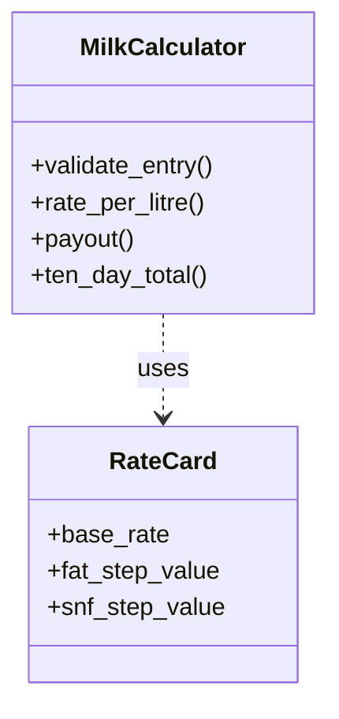

# UML - Payment Calculator

```mermaid
classDiagram
    class MilkCalculator {
        +validate_entry()
        +rate_per_litre()
        +payout()
        +ten_day_total()
    }

    class RateCard {
        +base_rate
        +fat_step_value
        +snf_step_value
    }

    MilkCalculator ..> RateCard : uses
```

The calculator separates validation, rate calculation, payment calculation and total calculation. A rate-card configuration keeps rate values in one place.
